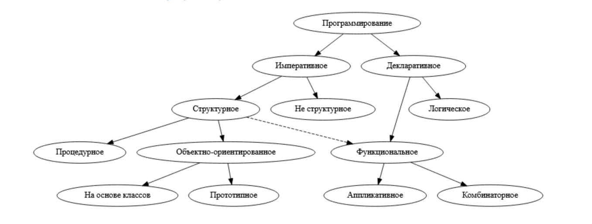

# Диаграмма парадигм программирования

### Императивное программирование

- Императивная — это самая простая и часто используемая парадигма. Её смысл в последовательном выполнении действий.

### Декларативное программирование

- Декларативная парадигма требует от программиста ответа на вопрос «что должно получиться?», а не «что нужно сделать?». Компьютер ищет способ получить требуемый результат.

### Структурное программирование

- парадигма, предполагающая написание программы как набора блоков. Такими блоками являются ветвления, циклы, последовательность утверждений. Благодаря наличию циклов с предусловием, постусловием и с параметром программа может полностью быть реализована без условных и безусловных переходов.

### Неструктурное программирование
- описание переменных
- последовательное выполнение утверждений
- метки
- безусловный переход goto
- условный переход if...goto

### Процедурное программирование

- предусматривает функциональный подход с хранением состояния программы.

- Базовым понятием в процедурном программировании является функция (процедура), которая представляет собой последовательность записанных и названных действий.
- Языки: C, Pascal, COBOL, ALGOL, BASIC, Fortran и т.д.

### Объктно-ориентированное программирование

- Это наиболее популярная, простая и многофункциональная парадигма среди современных вариантов. В ней появляются объекты, которые могут самостоятельно выполнять те или иные функции.
- Языки: Java, Python, C++, Ruby, C#, Objective-C, PHP

### Логическое программирование
- парадигма программирования, баз данных и представления знаний и рассуждений, основанная на формальной логике. Программа, база данных или база знаний на логическом языке программирования, представляет собой набор предложений в логической форме, выражающих факты и правила о некоторой проблемной области.

### Функциональное программирование

- В функциональном программировании функции рассматриваются как «полноправные граждане». Это означает, что их можно присваивать переменным, передавать в качестве аргумента и возвращать в качестве результата других функций. 